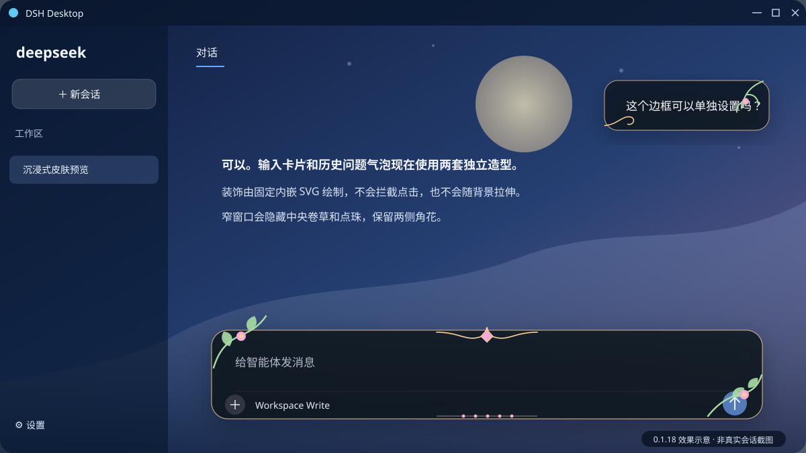

# DSH Desktop

面向 Windows 10/11 x64 的 DeepSeek Harness 桌面客户端。它使用 Tauri 2 与系统
WebView2，在独立窗口中运行官方 DSH WebUI，并提供当前用户安装、系统托盘、DSH/客户端
双通道更新和自定义沉浸式图片皮肤。

> DSH Desktop 是社区项目，不是 DeepSeek 官方发布物。当前面向个人和小范围测试使用。

上图是脱敏后的矢量效果示意，不包含真实壁纸、会话或用户数据。

## 核心功能

- **官方 WebUI 桌面化**：在独立窗口中运行兼容的 DeepSeek Harness WebUI，不要求用户
  手动下载源码或打开终端。
- **双通道安全更新**：分别检查 DSH runtime 和桌面客户端；runtime 经过大小、摘要、签名
  与隔离探活验证后才允许激活。
- **当前用户安装与托盘运行**：不需要管理员权限，关闭主窗口后可继续在系统托盘运行。
- **连续沉浸式皮肤**：一张本地图片可覆盖标题栏、侧栏和对话区，并独立调整背景模糊、
  毛玻璃、遮罩和图片不透明度。
- **独立对话表面**：`0.1.18` 为输入卡片和用户消息气泡加入不同圆角、阴影及植物系
  巴洛克装饰；装饰不拦截点击，并在窄窗口自动简化。
- **失败关闭**：DSH 版本或页面结构未经验证时，只撤销自定义皮肤并恢复官方界面，不阻断
  DSH 核心功能。

## 下载与快速开始

1. 前往 [最新 Release](https://github.com/ccx-dym/dsh-gui/releases/latest)，下载
   `DSH-Desktop_<版本>_x64-setup.exe`。
2. 安装并打开 DSH Desktop；安装范围仅为当前 Windows 用户。
3. 在“DSH 运行时更新”区域检查兼容版本，按提示安装经过签名验证的 runtime。
4. 完成冷启动探活后，主窗口会进入 DeepSeek Harness 官方 WebUI。

当前兼容通道提供 DSH `0.1.1-rc.2` Windows x64 runtime。皮肤只在精确验证的 DSH
版本和页面结构上启用。

## 安全与兼容说明

- DSH runtime、桌面客户端、用户数据和全局 `~/.dsh` 相互隔离，更新失败不会替换当前
  active runtime 或原数据。
- 桌面自动更新包使用 Tauri detached signature 验证。目前 Windows Authenticode 代码
  签名尚未配置，因此手动运行安装包时 Windows 可能显示“未知发布者”。
- 只从本仓库的 [Releases](https://github.com/ccx-dym/dsh-gui/releases) 下载安装包；反馈
  问题时不要提交 API Key、鉴权头或聊天内容。

## 文档

- [中文使用指南](docs/用户使用指南.md)：安装、更新、托盘、皮肤、数据目录与故障排查。
- [开发说明](docs/development.md)：环境、测试、RC 验收和发布流程。
- [版本记录](CHANGELOG.md)：桌面客户端版本变化与兼容说明。
- [Runtime 发布说明](docs/runtime-release.md)：兼容 runtime 的构建、签名和稳定通道。

发现问题时请附上桌面版本、复现步骤和脱敏后的诊断阶段。诊断日志位于
`%APPDATA%\DSH Desktop\logs`。
